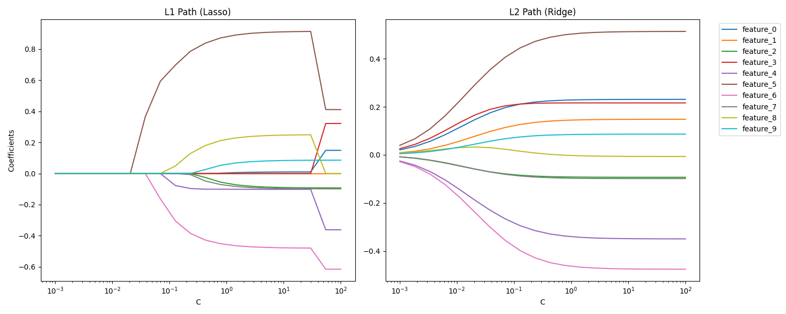

# Regularization Path Explorer (Stretch Challenge 5A)

## Project Overview
This project visualizes the impact of **L1 (Lasso)** and **L2 (Ridge)** regularization on Logistic Regression coefficients. By using the "Regularization Path" diagnostic tool, we can understand how different penalty types affect feature weights and model complexity.

## Key Visualizations
Below is the comparison between L1 and L2 regularization paths:

## Technical Analysis (Interpretation)
Based on the generated plots:

1. **L1 Regularization (Lasso):**
   - **Feature Selection:** As the regularization strength increases (moving to the left/lower C values), we can see that several features (e.g., `feature_0`, `feature_3`, `feature_7`) drop to exactly **zero**.
   - **Benefit:** This proves that L1 acts as a built-in feature selection tool by eliminating less important variables.

2. **L2 Regularization (Ridge):**
   - **Coefficient Shrinking:** Unlike L1, all coefficients shrink towards zero but **never reach it**. 
   - **Benefit:** L2 keeps all information but reduces its impact, which is useful when all features are expected to contribute slightly to the result.

3. **Stable Features:**
   - Features like **feature_5** (Brown) and **feature_6** (Pink) are the most stable, meaning they are the strongest predictors in this dataset.

## How to Run
1. Activate the virtual environment: `source venv/Scripts/activate`
2. Install dependencies: `pip install -r requirements.txt`
3. Run the script: `python main.py`